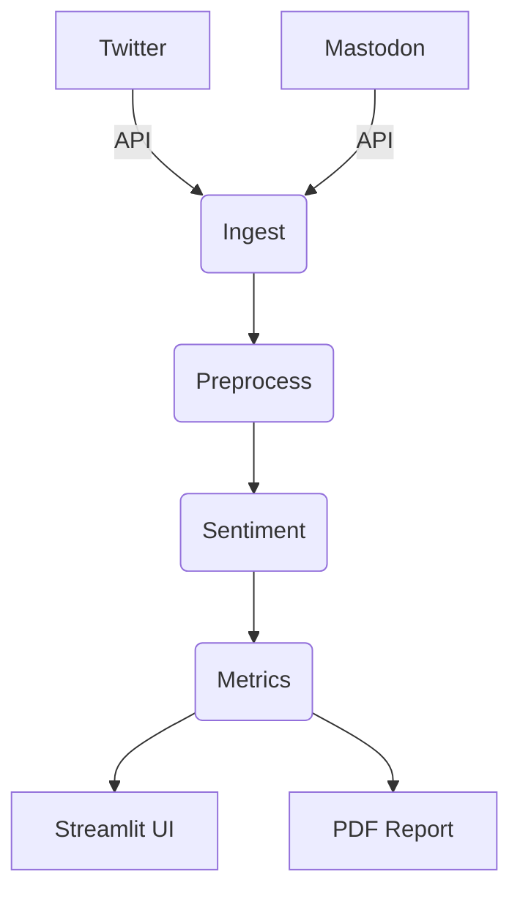

# Automatic Social Listening (Japanese)

## Setup
1. Install dependencies:
```
pip install -r requirements.txt
```
2. Run Streamlit app:
```
streamlit run frontend/ui_app.py
```
At launch, enter your Twitter bearer token and Mastodon credentials in the UI.


## Architecture


## License
MIT
