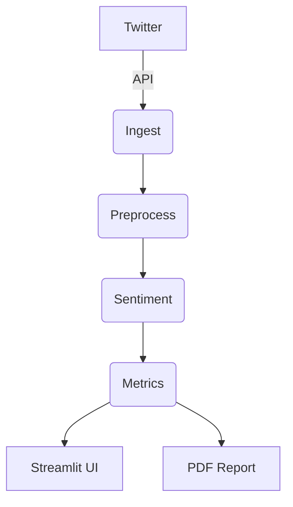

# Automatic Social Listening (Japanese)

## Setup
1. Install dependencies:
```
pip install -r requirements.txt
```
2. Run Streamlit app:
```
streamlit run frontend/ui_app.py
```
At launch, enter either a Twitter bearer token **or** OAuth1 credentials
(API key/secret and access token/secret) in the UI.
If the sentiment model is private, also provide your **Hugging Face token**.

## Obtaining credentials

### Twitter
1. Create a project and app at <https://developer.twitter.com/>.
2. In the app settings, generate an **OAuth 2.0 Bearer Token** or the
   **OAuth1 API key/secret** and **access token/secret**.
   Make sure the app has read permissions.


## Architecture


## License
MIT
