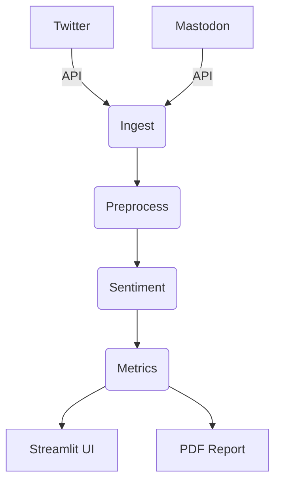

# Automatic Social Listening (Japanese)

## Setup
1. Create `.env` with the following:
```
TW_BEARER_TOKEN=xxx
MASTODON_API_BASE_URL=https://mastodon.example.com
MASTODON_ACCESS_TOKEN=yyy
```
2. Install dependencies:
```
pip install -r requirements.txt
```
3. Run Streamlit app:
```
streamlit run frontend/ui_app.py
```

## Architecture


## License
MIT
